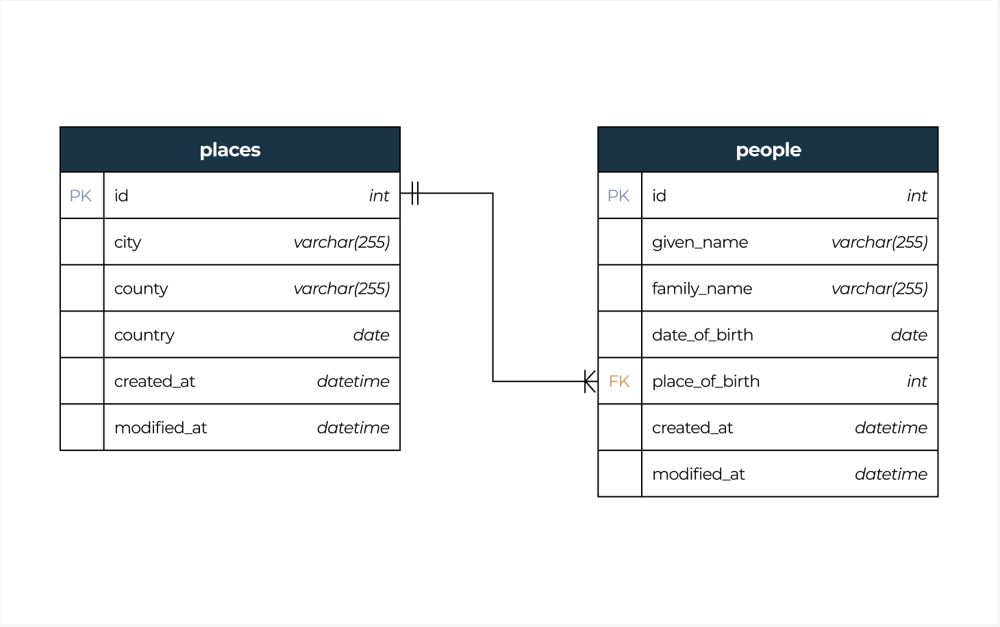

# Data Ingestion and Summary Application Assessment

## Overview

This application demonstrates a data ingestion and processing pipeline using Docker, Node.js, and MySQL. The project involves ingesting data from CSV files into a MySQL database, processing the data to generate a summary, and providing a Node.js CRUD API for interacting with the data.

## Application

1. **Data Ingestion**: Data from `places.csv` and `people.csv` is loaded into MySQL tables using a Node.js ingestion script running inside a Docker container.
2. **Summary Generation**: A summary of the data is generated, counting the number of people born in each country, and output as a JSON file (`summary_output.json`).
3. **CRUD API**: A Node.js CRUD application provides endpoints to interact with the ingested data in the database.

## Entity Relationship Diagram

Below is the entity relationship diagram illustrating the database schema used in this project:



## Technologies Used

- **Node.js**
- **MySQL**
- **Docker & Docker Compose**
- **Postman** (Optional) 

## Prerequisites

- **Node.js**
- **MySQL**
- **Docker**
- **Docker Compose**

## Project Structure

- **data**: Contains the CSV files (`places.csv`, `people.csv`) and output file (`summary_output.json`).
- **src**: Contains source code for data ingestion, summary generation, and CRUD operations.
  - **ingest**: Scripts for loading data into the database.
  - **generateSummary**: Script for generating the summary JSON.
  - **crud**: The Node.js CRUD application source code.
- **Dockerfiles**: Located within relevant subfolders to build images for ingestion, summary, and CRUD app.
- **docker-compose.yml**: Defines the services for the database, ingestion, summary generation, and CRUD app.


## How to Run the Project

1. **Clone or Fork the Repository**


2. **Build the Docker Image**

Build all the necessary Docker images using Docker Compose:

```
docker compose build
```

3. **Start the MySQL Database**

Start the database container first to ensure it's ready before running other services.

```
docker-compose up -d database
```

4. **Run the Data Ingestion**

Load data from the CSV files into the MySQL database.

```
docker-compose up -d ingest
```

5. **Generate the Summary**

Run the summary container to process the data and create the summary JSON.

```
docker-compose up -d summary
```

6. **Start the CRUD API**

Launch the Node.js CRUD application.

```
docker-compose up -d nodeapp
```

7. **Test Application**

- **CRUD API**: Use Postman or your browser to interact with the API endpoints. Example:
  - GET: http://localhost:3000/api/places
  - GET: http://localhost:3000/api/people
  - Add, update, or delete records using the relevant API routes.
- **Summary Output**: Check the data/summary_output.json file to verify that the summary is correctly generated.

## Clean Up

Stop and remove all running containers.

```
docker-compose down
```

